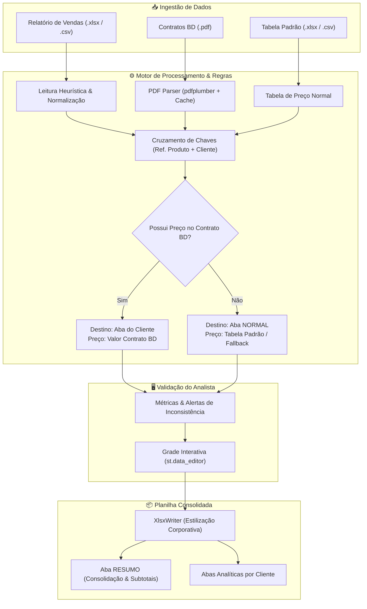

<!-- HEADER DO PROJETO -->
<div align="center">

  <h1>The Nehemizer</h1>
  <p><strong>Portal Financeiro & Equalizador de Contratos Hospitalares Saavedra</strong></p>

  <p>
    <em>“Equalização, auditoria e consolidação precisa para contratos financeiros e materiais hospitalares.”</em>
  </p>

  <p>
    <a href="https://the-nehemizer-saavedra.streamlit.app/">
      
    </a>
  </p>

  <p>
    <a href="CHANGELOG.md">
      
    </a>
    
    
    
    
    
    
  </p>

</div>

<hr />

## ⚡ O Desafio vs. A Solução (Antes x Depois)

<table width="100%">
  <thead>
    <tr>
      <th width="50%" align="left">❌ Processo Anterior (Manual & Fragmentado)</th>
      <th width="50%" align="left">✅ Com The Nehemizer (Automatizado & Integrado)</th>
    </tr>
  </thead>
  <tbody>
    <tr>
      <td>
        • Cruzamento manual entre planilhas do ERP e PDFs de contratos com dezenas de páginas.<br>
        • Alta propensão a erro humano em digitação e cálculo de preços unitários acordados.<br>
        • Dificuldade de segregar itens faturados fora de contratos especiais de fornecimento.<br>
        • Horas de trabalho repetitivo do analista financeiro a cada fechamento contábil.
      </td>
      <td>
        • <strong>Extração inteligente de PDFs:</strong> captura imediata de referências e preços acordados.<br>
        • <strong>Regra Suprema de Contingência:</strong> segregação automática entre contrato BD e aba normal.<br>
        • <strong>Prévia interativa em tempo real:</strong> edição e conferência assistida antes da exportação.<br>
        • <strong>Relatório contábil em segundos:</strong> geração de planilhas formatadas multi-aba com resumo executivo.
      </td>
    </tr>
  </tbody>
</table>

<br />

---

## 📌 Camada 1: Resumo Executivo

<div align="justify">

O **The Nehemizer** é uma solução corporativa desenvolvida para a **Saavedra** com o propósito de blindar a operação comercial e financeira na distribuição de materiais hospitalares (com destaque para a linha Becton Dickinson - BD).

Ao automatizar o cruzamento entre as vendas faturadas e as propostas comerciais vigentes, o sistema elimina discrepâncias de faturamento, assegura margens contratuais e fornece relatórios executivos prontos para auditoria interna e conciliação com parceiros.

</div>

<br />

### 🎯 Principais Benefícios Operacionais
* **Segurança de Margem:** Garante que cada item faturado utilize a tabela correta (preço acordado BD vs. tabela de compra padrão).
* **Agilidade no Fechamento:** Reduz o tempo de conciliação de horas para menos de um minuto.
* **Governança de Dados:** Padronização visual corporativa nas planilhas e rastreabilidade total de cada linha de venda.

<br />

---

## 🔄 Camada 2: Como Funciona (Jornada do Usuário)

O fluxo operacional do The Nehemizer é intuitivo e desenhado para apoiar o dia a dia do time financeiro:

```
[ 1. UPLOAD DOS ARQUIVOS ] 
       ↳ Relatório Bruto de Vendas (Excel / CSV)
       ↳ Contratos e Propostas BD (PDFs)
       ↳ Tabela Padrão de Preços (Opcional)
                   │
                   ▼
[ 2. PROCESSAMENTO INTELIGENTE ]
       ↳ Detecção heurística de cabeçalhos e colunas
       ↳ Extração automatizada de tabelas em PDFs via OCR/parsing
       ↳ Aplicação determinística da Regra Suprema de Contingência
                   │
                   ▼
[ 3. VALIDAÇÃO & CONFERÊNCIA EM TELA ]
       ↳ Dashboard de KPIs (Faturamento, Custos, Margem Média)
       ↳ Grade interativa para preenchimento de preços pendentes
                   │
                   ▼
[ 4. EXPORTAÇÃO EXECUTIVA ]
       ↳ Planilha multi-aba com formatação contábil Saavedra
       ↳ Aba RESUMO com subtotais consolidados por cliente
```

<br />

---

## ⚖️ Camada 3: Regras de Negócio Fundamentais

### 🛡️ A Regra Suprema de Contingência
A espinha dorsal do sistema consiste em determinar de forma automatizada o destino contábil de cada item faturado:

1. **Itens Vinculados a Contrato:** Se a referência do produto comercializado estiver presente na proposta/contrato em PDF aprovado para a instituição, o valor contratado é preservado e a linha é direcionada para a aba exclusiva daquele cliente.
2. **Itens Fora de Contrato (Contingência):** Se o produto não constar na proposta BD do cliente, o sistema automaticamente o encaminha para a aba **`NORMAL`** com o preço da tabela de compra padrão, protegendo a operação contra faturamentos indevidos.

### 🏥 Suporte a Múltiplas Instituições & Contratos
O The Nehemizer reconhece e classifica automaticamente faturamentos direcionados aos principais hospitais e planos de saúde parceiros da Saavedra, tais como:

<p align="center">
  
  
  
  
  
  
  
  
  
</p>

> [!TIP]
> Para consultar a especificação completa de de-para, termos de razão social, CNPJs e códigos oficiais de contrato BD, acesse o documento dedicado:  
> 📖 [**docs/regras-negocio.md**](docs/regras-negocio.md)

<br />

---

## 🛠️ Camada 4: Documentação Técnica & Arquitetura

### 🏛️ Fluxo do Motor de Dados



### 📂 Estrutura Modular do Repositório

```text
The-Nehemizer/
│
├── app.py                   # Ponto de entrada da aplicação Streamlit (UI & Orquestrador)
├── CHANGELOG.md             # Histórico de lançamentos e versões (SemVer)
├── README.md                # Apresentação e guia do projeto
├── CONFLUENCE.md            # Documentação técnica para base de conhecimento corporativa
├── requirements.txt         # Dependências do ecossistema Python
│
├── docs/                    # Especificações aprofundadas
│   └── regras-negocio.md    # De-para de contratos, termos, CNPJs e critérios de contingência
│
├── src/                     # Código-fonte desacoplado em camadas
│   ├── config/              # Parâmetros globais, cores oficiais e cadastro de clientes
│   │   └── settings.py
│   ├── services/            # Camada de lógica de negócio e processamento de dados
│   │   ├── business_rules.py# Aplicação da Regra Suprema e normalização de colunas
│   │   ├── excel_exporter.py# Geração multi-aba e formatação contábil via XlsxWriter
│   │   ├── pdf_service.py   # Parser de contratos em PDF com caching e Regex monetário
│   │   └── table_service.py # Leitor resiliente de planilhas e gerador de templates
│   └── utils/               # Componentes de interface e experiência do usuário
│       └── ui_components.py # Sidebar, métricas executivas, cabeçalho e modais
│
├── tests/                   # Suíte de testes unitários automatizados (Pytest)
│   ├── conftest.py          # Configuração de PYTHONPATH
│   └── test_business_rules.py # Testes de regras de negócio, contratos e exportador
│
├── .devcontainer/           # Configuração de ambiente conteinerizado VS Code
└── .vscode/                 # Configurações de workspace do desenvolvedor
```

<br />

### 🚀 Guia de Execução Local

<details open>
<summary><strong>💻 Executando em Ambiente Python Nativo</strong></summary>

<br />

1. **Clonar o Repositório:**
   ```bash
   git clone https://github.com/suportesaav-web/The-Nehemizer.git
   cd The-Nehemizer
   ```

2. **Criar e Ativar Ambiente Virtual:**
   - **Windows (PowerShell):**
     ```powershell
     python -m venv .venv
     .\.venv\Scripts\Activate.ps1
     ```
   - **Linux / macOS:**
     ```bash
     python3 -m venv .venv
     source .venv/bin/activate
     ```

3. **Instalar Dependências:**
   ```bash
   pip install -r requirements.txt
   ```

4. **Executar Testes Automatizados:**
   ```bash
   pytest tests/ -p no:cacheprovider
   ```

5. **Iniciar a Aplicação:**
   ```bash
   streamlit run app.py
   ```
   Acesse no navegador: `http://localhost:8501`.

</details>

<details>
<summary><strong>🐳 Executando via Docker / VS Code DevContainers</strong></summary>

<br />

1. Abra a pasta do projeto no **VS Code** com a extensão Dev Containers instalada.
2. Pressione `F1` e selecione **"Dev Containers: Reopen in Container"**.
3. O contêiner configurará automaticamente o ambiente Python 3.11 com todas as bibliotecas na porta `8501`.

</details>

<br />

---

## 👨‍💻 Autoria & Suporte Corporativo

<div align="center">

<table width="80%">
  <tbody>
    <tr>
      <td width="30%" align="center">
        <br><br>
        <strong>Saavedra Suporte Web</strong>
      </td>
      <td width="70%" align="left">
        <strong>Desenvolvedor Principal:</strong> Jonatan Severo<br>
        📧 <strong>E-mail:</strong> <a href="mailto:suporte.saav@saavedra.com.br">suporte.saav@saavedra.com.br</a><br>
        💼 <strong>LinkedIn:</strong> <a href="https://www.linkedin.com/in/jonatanfsevero/" target="_blank">linkedin.com/in/jonatanfsevero</a><br>
        🏢 <strong>Organização:</strong> Saavedra Representações e Distribuição
      </td>
    </tr>
  </tbody>
</table>

<br>

<sub>Desenvolvido com excelência para uso corporativo exclusivo da <strong>Saavedra</strong>. Todos os direitos reservados.</sub>

</div>
## License
This project is licensed under the MIT License - see the LICENSE file for details.
