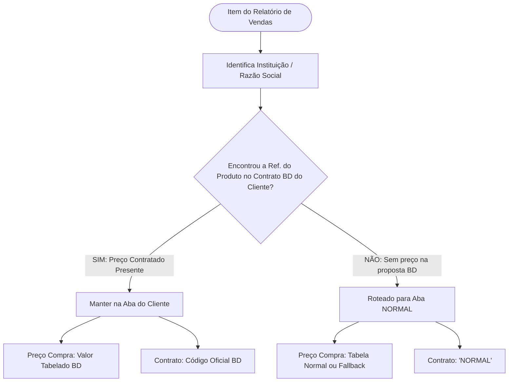

# ⚖️ Regras de Negócio e Mapeamentos — The Nehemizer

> **Documento Funcional e de Governança de Negócio**  
> **Sistema:** The Nehemizer (Portal Financeiro Saavedra)  
> **Aplicação:** Conciliação, auditoria e equalização de contratos de distribuição hospitalar.

---

## 1. 🎯 Propósito Operacional

O **The Nehemizer** foi desenvolvido para garantir a conformidade e a integridade financeira no faturamento de produtos hospitalares (especialmente da linha Becton Dickinson - BD) distribuídos pela **Saavedra**.

O sistema opera na intersecção de três fontes de dados:
1. **Relatório Bruto de Vendas:** Registros diários/mensais extraídos do ERP da Saavedra contendo pedidos faturados.
2. **Contratos e Propostas Comerciais BD (PDF):** Documentos oficiais com vigência e preços unitários tabelados por instituição.
3. **Tabela de Preço Normal / Padrão:** Catálogo referencial de compras para itens comercializados fora de acordos específicos.

---

## 2. ⚖️ A Regra Suprema de Contingência

A **Regra Suprema de Contingência** é a espinha dorsal lógica do The Nehemizer. Ela estabelece um critério determinístico para classificar se uma venda deve usufruir da precificação de contrato ou se deve ser segregada para tratamento padrão.



### Critérios da Regra:
* **Precedência de Contrato:** Se o produto constar na proposta/contrato em PDF daquele cliente, o preço de compra assumido será estritamente o valor pactuado (`VALOR_TABELADO_BD`). O item permanece associado à aba individual da instituição.
* **Segregação de Risco (Aba NORMAL):** Qualquer item vendido para o cliente que **não conste** na sua proposta BD é automaticamente redirecionado para a aba `NORMAL`. Isso previne glosas, faturamentos errôneos com margens negativas e inconsistências fiscais.
* **Priorização do Preço de Compra Final:**
  $$\text{Preço de Compra Final} = \text{Valor Tabelado BD} \lor \text{Preço Normal} \lor \text{Edição Manual do Analista}$$

---

## 3. 🏢 Mapeamento de Clientes e Contratos BD

A identificação de qual cliente/instituição corresponde ao faturamento baseia-se na varredura da Razão Social, Convenções e CNPJs do parceiro comercial.

A tabela oficial de correspondência está centralizada no arquivo de configuração do sistema:

| Instituição / Parceiro | Termos Reconhecidos na Razão Social | CNPJ Raiz / Códigos de Busca | Código Contrato BD | Aba no Relatório |
| :--- | :--- | :--- | :---: | :---: |
| **UNIMED** | `UNIMED` | `87096616` | `450128261` | `UNIMED` |
| **PUC** | `UNIAO BRASILEIRA`, `PUC` | `88630413` | `450155842` | `PUC` |
| **H DIVINA** | `DIVINA` | `87317764` | `450146829` | `H DIVINA` |
| **HCPA** | `CLINICAS` | `87020517` | `450139832` | `HCPA` |
| **SMS POA** | `PORTO ALEGRE` + (`PREF` / `MUNICIPIO`) | `92963560` | `450120243` | `SMS POA` |
| **EBSERH** | `EBSERH`, `SERVICOS HOSPITALARES` | `15126437` | `450098658` | `EBSERH` |
| **HCAA** | `ASTROGILDO` | `95610887` | `450137626` | `HCAA` |
| **GHC / CONCEIÇÃO** | `GHC`, `CONCEICAO`, `CONCEIÇÃO` | `450166419` | `450166419` | `CONCEICAO` |
| **SANTA CASA** | `SANTA CASA` | — | *Em negociação* | `SANTA CASA` |
| **FORA DE CONTRATO** | Produtos sem correspondência tabelada | — | `NORMAL` | `NORMAL` |

> [!NOTE]
> Os números de contrato e termos acima são gerenciados de forma centralizada em [`src/config/settings.py`](file:///c:/Users/SAAV054/Documents/Desenvolvimento/The-Nehemizer/src/config/settings.py) via estrutura `CLIENTES_CONFIG`.

---

## 4. 📄 Normalização e Higienização de Vendas

Os relatórios exportados pelo ERP podem conter cabeçalhos deslocados ou nomes ligeiramente divergentes. O sistema aplica heurísticas inteligentes de normalização:

### 4.1 Detecção Automática de Cabeçalhos
* Varre até as primeiras 20 linhas procurando palavras-chave como `RAZAOSOCIAL` ou `CONVENIO`.
* Se detectado numa linha intermediária, redefine automaticamente essa linha como o cabeçalho oficial do DataFrame.

### 4.2 De-Para de Sinônimos de Colunas
* **Referência do Produto:** `REF`, `PROD` $\rightarrow$ `REFPROD` (com remoção de `.0` de inteiros convertidos em float).
* **Descrição do Produto:** `DESC` $\rightarrow$ `DESCRICAO`
* **Quantidade Comercial:** `QTD` $\rightarrow$ `QTDCOM`
* **Valor Total de Venda:** `VLR`, `VALOR` $\rightarrow$ `VLRTOTAL`
* **Razão Social do Cliente:** `RAZ`, `SOC` $\rightarrow$ `RAZAOSOCIAL`
* **Convênio / Contrato do Cliente:** `CONV`, `CONTRATO` $\rightarrow$ `CONVENIO` / `CONTRATOCLIENTE`

---

## 5. 📑 Extração em PDFs de Contratos (Parsing)

1. **Leitura Multi-Página:** O parser analisa as primeiras páginas do PDF para identificar a instituição destinatária da proposta.
2. **Extração Tabular:** Extrai tabelas contendo código de referência do produto e valor unitário.
3. **Regex de Moeda:** Suporta formatações brasileiras com e sem símbolo (`R$ 1.250,00`, `1250,00`, `45,20`).
4. **Cache em Memória:** Processamento acelerado com `@st.cache_data` para evitar reprocessamento repetitivo de arquivos pesados.

---

## 6. 📊 Estrutura de Exportação (XlsxWriter)

A planilha gerada (`PROCESSADO_Relatorio_Final_TheNehemizer.xlsx`) atende ao padrão contábil executivo:

1. **Aba RESUMO (Consolidada):**
   * Agrupada por cliente/aba destino (`SIGLA_RESUMO`).
   * Totaliza: Faturamento Bruto de Venda, Custo Estimado de Compra, Margem Bruta e Percentual de Margem.
   * Linha de **Total Geral** com fórmulas nativas do Excel (`SUBTOTAL` / `SUM`).
2. **Abas Analíticas por Instituição:**
   * Cada cliente com itens válidos recebe uma aba dedicada.
   * Aba `NORMAL` agrupa todos os itens de contingência e faturamento livre.
   * Colunas monetárias com formatação contábil nativa `R$ #,##0.00`.
   * Cabeçalho corporativo oficial Saavedra (Laranja `#DC4405` e texto branco em negrito).

---

## 7. 🛠️ Como Adicionar ou Atualizar um Contrato

Para atualizar um contrato vigente ou cadastrar um novo cliente, basta alterar a lista `CLIENTES_CONFIG` em [`src/config/settings.py`](file:///c:/Users/SAAV054/Documents/Desenvolvimento/The-Nehemizer/src/config/settings.py):

```python
# Exemplo de inclusão de novo hospital:
{
    'sigla': 'HOSPITAL MAE DE DEUS',
    'contrato': '450199999',
    'termos': ['MAE DE DEUS', 'HMD', '92723000']
}
```

Nenhum outro arquivo precisa ser modificado; os serviços de parsing, regras e interface refletirão a alteração automaticamente.
